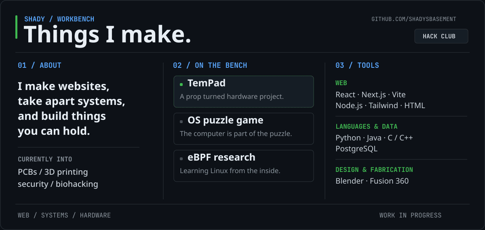

## I'm shady.

I like making things that sit somewhere between a screen and a workbench. Sometimes that's a web app; sometimes it's an operating system you have to solve, or a piece of hardware from a TV show made real. I'm part of [Hack Club](https://hackclub.com/).

### What I'm working on

| Project | The idea |
| :-- | :-- |
| **TemPad** | A real hardware take on the device from *Loki*. |
| **OS puzzle game** | A puzzle game where using the operating system is part of figuring it out. |
| **eBPF rootkit research** | A low-level security project exploring how Linux systems behave under the hood. |

### What I use

| | |
| :-- | :-- |
| **Web** | React, Next.js, Vite, Node.js, Tailwind CSS, HTML |
| **Languages and data** | Python, Java, C, C++, PostgreSQL |
| **Design and fabrication** | Blender, Fusion 360 |

I'm learning Altium Designer, PCB design, 3D printing, cybersecurity, and biohacking. The project list will get links as I publish the work.

### Contributions

This account is a fresh start. [The contribution graph](https://github.com/shadysbasement?tab=overview) is the real record of what I've put out so far.

If you want to talk about any of it, [open an issue here](https://github.com/shadysbasement/shadysbasement/issues/new).
