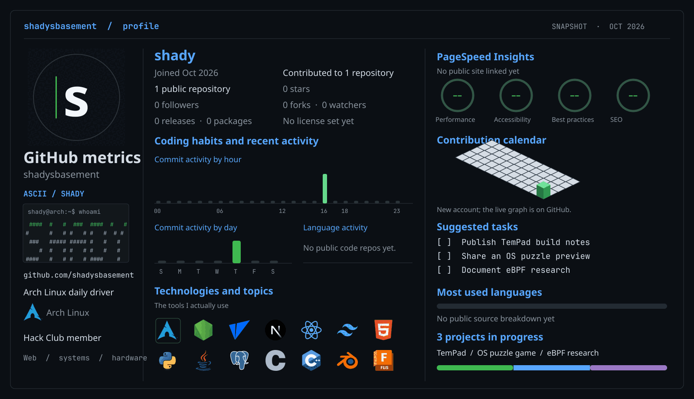
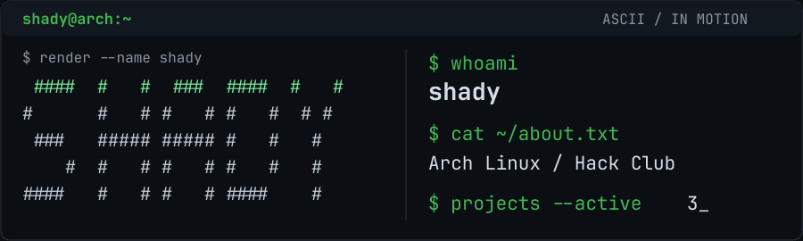
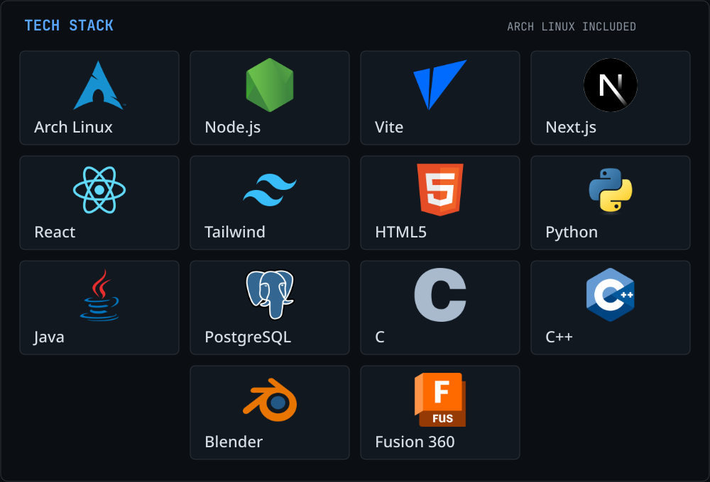

  

  

## hiiiii

I use Arch Linux and spend a lot of time moving between a browser, a terminal, and a workbench. I like web apps, odd interfaces, low-level systems, and making physical versions of things that started as fiction.

### On the workbench

| Project | What it is |
| :-- | :-- |
| **TemPad** | A real hardware take on the device from *Loki*. |
| **OS puzzle game** | A game where figuring out the operating system is part of the puzzle. |
| **eBPF stealth rootkit** | A systems and security experiment I'm building to learn more about Linux internals. |

These are works in progress. I'll link the code and build notes as I put them out.

### Tech stack

I'm learning Altium Designer, PCB design, 3D printing, cybersecurity, and biohacking.

### Activity and contributions

This is a new account, so the charts are still filling in. The dashboard above is a snapshot; [GitHub's contribution calendar](https://github.com/shadysbasement?tab=overview) is the live version. PageSpeed and language breakdowns will appear once there's a public site and source code to measure.

If one of these projects sounds interesting, [open an issue here](https://github.com/shadysbasement/shadysbasement/issues/new).

Technology logos from [Devicon](https://github.com/devicons/devicon).
