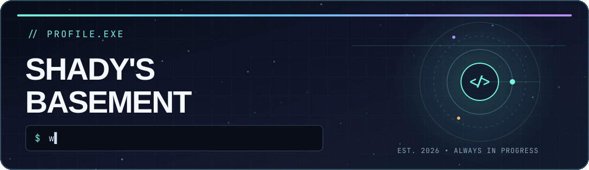

 

### Hey, I'm shady 👋

**I build web experiences, explore systems, and turn strange ideas into real hardware.**

<a href="#about-me">About</a> &nbsp;·&nbsp; <a href="#tech-stack">Tech stack</a> &nbsp;·&nbsp; <a href="#on-the-workbench">Projects</a> &nbsp;·&nbsp; <a href="#contributions">Contributions</a>

---

### About me

I'm a builder who likes crossing the line between software and hardware. One day that means a web interface; the next it means an operating-system puzzle, an eBPF experiment, or a prop made real. I'm part of [Hack Club](https://hackclub.com/), and this new GitHub is where I'm sharing the journey from the first commit onward.

> **Currently exploring:** Altium Designer, PCB design, 3D printing, cybersecurity, and biohacking.

### Tech stack

| Web and UI | Languages and data | 3D and design |
| :-- | :-- | :-- |
| **React** · **Next.js** · **Vite** | **Python** · **Java** · **C / C++** | **Blender** · **Fusion 360** |
| **Node.js** · **Tailwind CSS** · **HTML** | **PostgreSQL** | From concept to prototype |

### On the workbench

| Project | What I'm making |
| :-- | :-- |
| **eBPF stealth rootkit** | A low-level systems and cybersecurity experiment. |
| **OS-based puzzle game** | A game where the operating system is part of the puzzle. |
| **TemPad** | A hardware build inspired by the device from *Loki*. |

These are works in progress. I'll link the source and build notes here as they become public.

### Contributions

This account is a fresh start. The activity below is real and will grow as I publish code, fixes, and build logs.

**[See my live GitHub contribution activity →](https://github.com/shadysbasement?tab=overview)**

### Say hello

Have an idea, want to collaborate, or just want to talk about a build? [Start a conversation in this repo](https://github.com/shadysbasement/shadysbasement/issues/new).

---

Code · circuits · curiosity

